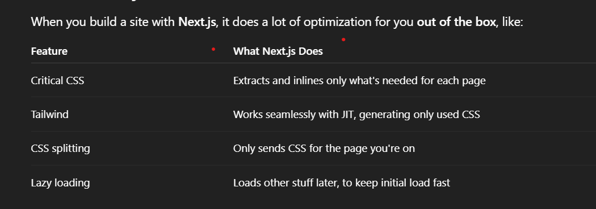
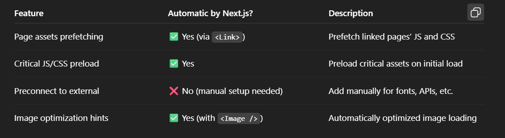

FrontEnd Optimization Technique:

1. Adding async,defer to the script file
2. Implement the Lazy Loading to improve Performance
3. Using this css property we tell the browser to Load only required concent , so that we can make our rendering time even more faster (along with we can use infinite scrolling and pagination):

- content-visibility:auto; -> only content will load those in the screen view
- contain-intrinsic-size:1000px; - > we have avoid the layout shifting

- Serving Critical Css :
    <link
              rel="preload"
              href="/styles/tailwind.css"
              as="style"
              onload="this.onload=null;this.rel='stylesheet';"
              />
    <noscript><link rel="stylesheet" href="/styles/tailwind.css" /></noscript>

  - but tailwind css it already optimize the thing JIT jus-in-time and next js will do automatically all the optimization so we no need to worry about that...
    

# Next js :

- Next js done critical css automatically , lets take a example , user visit our website 1st user will see the home page , next js use code splitting and only render that particular page and only that particular page as marked as critical css and that will loaded

## Resource Hinting

- It’s about telling the browser early about resources it will need soon (fonts, scripts, images, next pages) so the browser can start fetching them before they’re actually used, making your site faster.

## What’s Going On Under the Hood?

- During build and server-side rendering, Next.js analyzes dependencies of the page:

- Which JavaScript chunks are needed?

- Which CSS files?

- Which images?

- It then injects proper <link rel="preload"> and <link rel="prefetch"> tags into the HTML header.

- When a page includes <Link href="/nextpage" />, Next.js adds prefetch behavior to start loading next page assets when appropriate.

1.  Automatic Prefetching of Pages
    When you use Next.js’s <Link> component to link between pages, Next.js automatically prefetches the JavaScript and other assets for the linked page in the background — but only when the link is visible in the viewport (and on hover/focus).

                export default function Home() {
                return (
                    <Link href="/about">
                    <a>About</a>
                    </Link>
                );
                }

This means when the user clicks that link, the next page loads super fast because assets are already downloaded.

2. Automatic Preloading of Critical JS and CSS
   Next.js knows what scripts and styles are critical for the current page and adds <link rel="preload"> tags in the HTML it serves, so the browser starts loading them as soon as possible.

This happens under the hood during the build process and server rendering, no manual work needed.

3. Preconnect for External Resources
   Next.js does not automatically add preconnect for all external resources, but popular assets like Google Fonts often get this done by Next.js starter templates or plugins.

You can add these yourself manually in <Head>, or use third-party plugins if needed.

4. Image Optimization
   With Next.js <Image /> component, the browser only fetches optimized image assets it needs, and Next.js automatically adds resource hints to optimize loading.

Refer this Article => https://www.keycdn.com/blog/resource-hints

- **preload is use load our page and pre-connect is used to connect with another domain**

# Layout shifting & repaints :

  

## Why Next.js asks you to specify width and height on <Image>:

Reserving space: When you give Next.js the width and height, it can reserve the correct amount of space on the page before the image loads.

This prevents the browser from suddenly changing the layout when the image finally appears (avoiding layout shifts).

If you don’t provide these, Next.js doesn’t know how much space to reserve, so the image loads and "pushes" content around — causing a layout shift.
